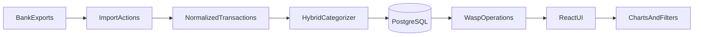

# Zaster Master

Local personal finance app for importing German bank exports, categorizing transactions without paid AI, linking related movements, and analyzing spending.

| | |
|---|---|
| **Brand** | Zaster Master |
| **UI language** | German |
| **Privacy** | Local-only — data stays on your machine |
| **Auth** | None in v1 (single-user); may be added later |
| **Stack** | [Wasp](https://wasp.sh) + React + Prisma + PostgreSQL |
| **DB runtime** | PostgreSQL via Docker Compose (`docker compose up -d db`) |
| **Windows** | **WSL required** for Wasp; Docker Desktop for the DB |

Sample exports: [`Bankauszüge/`](../Bankauszüge/). Design assets: [`Design/`](../Design/). Feature specs: [`docs/`](docs/) (filled as features are built).

This README ([ai/README.md](ai/README.md)) is the product and architecture source of truth. Cursor rules in [`.cursor/rules/`](../.cursor/rules/) must match it.

---

## Goals

- Import statements from multiple German banks and wallets into one place.
- Categorize transactions for analysis **without subscriptions or API token costs**.
- Link related transactions (PayPal ↔ bank, account-to-account transfers) so they do not double-count in totals.
- Show what you actually own now, even when statement history is incomplete.
- Stay well structured and documented (`ai/docs/` + feature folders).

## Non-goals (v1)

- Authentication / multi-user (roadmap: may come later)
- Public cloud hosting (roadmap: may come later; not Fly.io in v1)
- Background job queue (import/related-detect use actions + UI progress instead)
- Full-app Docker packaging (Compose is **Postgres only**)
- Paid cloud AI as the default categorizer
- Replacing your bank’s official app or doing payments

---

## Architecture

**Stack (locked):**

| Layer | Choice |
|---|---|
| Framework | Wasp (config in `main.wasp` / `main.wasp.ts`) |
| Frontend | React + TypeScript, Tailwind CSS, Shadcn/ui, Chart.js (or similar), **Lucide** icons |
| Backend | Node.js (Wasp server), TypeScript |
| Client ↔ server | **Wasp operations** (queries = read, actions = write) |
| Database | **PostgreSQL** via Prisma (`schema.prisma`) |
| DB process | **PostgreSQL in Docker** (`docker compose up -d db`); `DATABASE_URL` in `.env.server` |
| App process | `wasp start` (dev) — on Windows, run this **inside WSL** |
| Network | Localhost only in v1 |

**Why this stack:** Full-stack TypeScript with Wasp, Prisma models, typed operations, and a clear path to auth later. PostgreSQL fits Prisma well. **Docker runs Postgres only**; day-to-day app work stays on the Wasp CLI in WSL.

**Windows / WSL:** Wasp needs a Unix environment — use **WSL** for `wasp start`. Docker Desktop provides the database. Keep the project on the **Linux filesystem** when possible for file watching; `/mnt/c/...` works but can be slower.



### Environment

```bash
# Windows (PowerShell) or WSL — start Postgres
docker compose up -d db

# WSL — run the app (Node + Wasp CLI)
# DATABASE_URL is in .env.server (see .env.server.example)
wasp db migrate-dev
wasp start
```

**Unit tests** (no DB): `npm test` — see [`docs/testing.md`](docs/testing.md). Synthetic fixtures only (no real bank exports). Manual smoke: `Bankauszüge/*_Tester*` + checklist in that doc.

| Piece | Role | Typical port |
|---|---|---|
| PostgreSQL (`zastermaster-db`) | Database (Docker) | `5432` |
| Wasp server | Operations / APIs | Wasp default (often `3001`) |
| Wasp client | React UI | Wasp default (often `3000`) |

**Persistence:** Docker volume `zastermaster_pgdata`. Back up that volume or use `pg_dump` if you care about history.

**Privacy:** Do not publish `Bankauszüge/` or DB dumps. Keep the app on localhost.

**Design assets:** Serve logo + background from the client (`Design/` or `public/`).

**Docker scope:** Postgres only in v1. Do not containerize the whole Wasp app for normal development.

### Background jobs — what they are (and v1 choice)

A **job queue** (in Wasp: Jobs + PgBoss on PostgreSQL) runs long work **outside** a single HTTP request: e.g. scanning all transactions for related pairs, huge imports, later ML training.

**v1 decision: no job queue.** Import and “Zusammengehörige Transaktionen erkennen” run in actions with UI progress. Add Jobs later if those flows feel too slow or time out.

---

## Documentation & conventions

- **Config source of truth:** `main.wasp` (routes, pages, operations) + `schema.prisma` (models).
- **Feature docs (existing):** [`prd.md`](docs/prd.md), [`implementation-plan.md`](docs/implementation-plan.md), [`design.md`](docs/design.md), [`transactions.md`](docs/transactions.md) (includes related-detect), [`analysis.md`](docs/analysis.md), [`categorization.md`](docs/categorization.md), [`investments.md`](docs/investments.md), [`testing.md`](docs/testing.md). Import and accounts domain rules live in **this README** until split out. Update the matching doc when behavior changes.
- **Code:** `src/features/{featureName}/` with `operations.ts` for that feature’s queries/actions.
- **Regions in `main.wasp`:** group feature declarations with `//#region` / `//#endregion`.
- **TypeScript only** for app code (`.ts` / `.tsx`).
- **Imports:** `wasp/...` in TS/TSX; `@src/...` only inside `main.wasp`; relative imports within `src/`.
- **Deps:** `npm install` (do not stuff dependencies into `main.wasp`).

---

## Domain model (Prisma)

Define models in `schema.prisma`. Apply with `wasp db migrate-dev`.

### Transaction

| Field | Notes |
|---|---|
| `datum` | `DateTime` @ date |
| `betrag` | Signed Decimal: income `>`, expense `<` |
| `sender`, `empfaenger`, `verwendungszweck`, `iban`, `kundenreferenz` | From export |
| `categoryId`, `subcategoryId` | FK; defaults Sonstige / Unbekannt |
| `confidenceScore` | Manual edit → `1.0` |
| `bank` | `dkb` \| `sparkasse` \| `paypal` \| `traderepublic` |
| `konto` | e.g. Girokonto, Tagesgeld, PayPal |
| `balance` | Optional export snapshot; not a full ledger |
| `relatedTransactionId` | Pair partner id (both directions for size-2 groups) |
| `relatedGroupId` | Shared group id for 2–3 linked txs (source of truth) |
| `relatedType` | `paypal_bank` \| `paypal_purchase` \| `transfer` \| `near_duplicate` |

**Dedup key:** unique on `(bank, konto, datum, betrag, verwendungszweck, iban, kundenreferenz)` (normalize empty `iban` / `kundenreferenz` to `''` so NULLs don’t bypass uniqueness). Bank+Konto are included because PayPal/Trade Republic rows often lack IBAN.

Importers normalize to the same logical columns: Datum, Betrag, Sender\*in, Empfänger\*in, Verwendungszweck, IBAN, Kundenreferenz, Bank, Konto, balance.

### Account & balance calibration

Incomplete history is expected. Accounts are first-class:

1. User enters **bank balance** + **as-of date** per account (calibration checkpoint).
2. **Display (roll-forward):** per account  
   `Anzeige = kalibrierter Stand + Summe(Betrag) mit Datum > asOfDate` for that `bank`/`konto`; header = sum of those displays.
3. Calibration writes a synthetic marker tx (`isBalanceAdjustment`, betrag 0); excluded from Analyse and from Transaktionen by default (optional filter to show).
4. Re-calibrate any time under Einstellungen → Konten.
5. Row `balance` stays export snapshot metadata; it does not drive the header.

Not “balance of the currently filtered Konto” unless we add that later.

Ask for balance on first upload of a new account.

### Categories & learned rules

Full model + editing + algorithm: [`docs/categorization.md`](docs/categorization.md).  
Seed: [`categories_seed.json`](../categories_seed.json). PostgreSQL is source of truth (not live JSON).

### Related transactions

Bidirectional pair link and/or shared `relatedGroupId` + `relatedType`. Used for:

1. **Navigation** — table link icon → `getTransactionNav` → jump page if needed → scroll/highlight row → open Details.
2. **Analyse netting** — confirmed pairs do not double-count (PayPal↔bank keeps PayPal leg when both in filter; transfers drop both when both in filter).
3. **Shared category** — linked legs always share the same category/subcategory:
   - Manual categorize on either leg updates **both**.
   - On **confirm**, copy the stronger category (`manual` > `learned` > `keyword` > `none`) onto the other leg.
4. **Detectors** — PayPal↔bank (same sign), Umbuchung (opposite sign + keyword/token), near-duplicate (same account/day).

Rejects persist in `RelatedRejection` so the same pair is not suggested again.

Full UI/detect: [`docs/transactions.md`](docs/transactions.md). Netting: [`docs/analysis.md`](docs/analysis.md).

## Categorization (hybrid, free by default)

Full spec: [`ai/docs/categorization.md`](docs/categorization.md).

**Order:** learned rules (if any) → keywords (sub then main) → Sonstige/Unbekannt. Manual → `1.0` + optional “merken” (Slice 3 Thick). Konfidenz color follows **source**. Tree CRUD in Einstellungen; seed from `categories_seed.json`.

---

## Import pipeline

Wasp **action** (multipart upload + required `bank` — not auto-detected):

1. Validate structure for that bank.
2. Bank-specific importer → normalized rows.
3. Keep UTF-8 / umlauts.
4. Auto-categorize (hybrid).
5. Insert with dedup.
6. Return `{ success, importedCount, duplicateCount, … }`.

**Supported importers:** DKB (Giro/Tagesgeld CSV), PayPal (German TSV), Sparkasse (MT940-like TXT), Trade Republic (transactions CSV).  
Samples under `Bankauszüge/`. Wrong bank selection is rejected via format sniffing (`detectLikelyBank`).

Parsing of messy German CSV/TXT lives in TypeScript server modules under `src/features/import/` (Papa Parse or similar). Keep importers versioned and testable.

---

## Related transactions

**Tolerance:** ±3 days, ±0.01 €.

| Type | Idea |
|---|---|
| PayPal ↔ bank | Same abs amount, **same sign**, within tolerance (both look like expenses when funding a purchase, or both income on refund) |
| Internal transfers | ≈ **opposite** amounts; different bank/konto; purpose keywords (`überweisung`, `umbuchung`, …) or name cross-match |
| Near-duplicates | Same date/bank/amount + ≥50% purpose-word overlap — suggest link or flag; do **not** auto-delete |

**Flow:** detect action → UI review → confirm/reject → bidirectional IDs.  
**Detailed frontend + detection plan:** [`ai/docs/transactions.md`](docs/transactions.md) (section *Zusammengehörige Transaktionen erkennen*).  
**Analysis:** net confirmed pairs so totals/charts do not double-count ([`analysis.md`](docs/analysis.md)).

---

## UI

**Shell:** root React component with shared header + `<Outlet />` for pages (Wasp routes).

**Header (primary nav — no tab carousel):**

| Element | Role |
|---|---|
| Logo | Brand mark from `Design/Zaster_Master_Logo.svg` (default route: Transaktionen) |
| Balance | Calibrated total, `de-DE` EUR |
| Upload icon | Upload page |
| Settings icon | Einstellungen → Kategorien (v1) |
| Transaktionen icon | Transaktionen |
| Analyse icon | Analyse |

| Page | Role |
|---|---|
| **Upload** | Bank + file drop; progress; lock nav while importing; then → Transaktionen |
| **Einstellungen / Kategorien** | Manage the category tree: create/rename/delete/recolor categories; add/edit/remove **subcategories**; edit **keywords** on a main category and/or on each subcategory (these drive auto-categorization on import) |
| **Transaktionen** | Table + page summary (income / expenses / count for **current table filters**, default: no date filter = all imported txs); confidence; details; related detect |
| **Analyse** | Filtered period insights: trend, category pies, expandable breakdowns; related pairs netted |

**Styling stack:** Tailwind + Shadcn/ui in `src/components`; German copy; desktop-primary.

Full visual requirements: [`ai/docs/design.md`](docs/design.md).

### Transaktionen (details)

Full spec: [`ai/docs/transactions.md`](docs/transactions.md).

- Wide filterable/paginated table; summary strip for **current table filters** (default: all time).
- Default columns + optional IBAN / Kundenreferenz / Verknüpfung via Filter.
- Details overlay (categorize; “merken” = Slice 3 Thick); related-detect overlay (progress → confirm/reject).
- Both legs of a link stay visible here; Analyse does the netting.
- Partner column: clickable link → scroll to partner row + open Details (page jump via `getTransactionNav` when needed).
- Categorize one linked row → category syncs to the partner.

### Analyse (details)

Full spec: [`ai/docs/analysis.md`](docs/analysis.md).

**Defaults:** all Konten, current calendar year (1 Jan → today).

**Filters:** Zeitraum (year / month / custom from–to), optional Kategorie / Unterkategorie, multi bank/Konto, Typ (alle / Ausgaben / Einnahmen).

**Views:** (1) Zeitlicher Trend Einnahmen vs Ausgaben · (2) Ausgaben nach Kategorie · (3) Einnahmen nach Kategorie · (4) Ausgaben-Aufschlüsselung · (5) Einnahmen-Aufschlüsselung — plus summary strip (Einnahmen, Ausgaben, Netto, Buchungen).

**Netting:** confirmed related pairs must not double-count; own-account transfers drop both legs when both are in scope; PayPal↔bank counts the PayPal/wallet leg once when both are in scope. Server-side aggregation only.

---

## Operations surface (Wasp)

Prefer **queries/actions** over custom HTTP APIs for app features. Use `api` routes only for external integrations if ever needed.

| Area | Kind | Purpose |
|---|---|---|
| Upload / import | action | Parse + insert + categorize |
| Transactions | query + actions | List (paginated), categorize, delete-all |
| Related | actions + query | Detect, confirm, list |
| Categories | query + actions | CRUD → Postgres |
| Accounts | query + actions | Calibrated balance |
| Analysis | queries | Aggregates + stats |

Analysis aggregates must net related pairs. Paginate large lists.

---

## Product rules

- Signed amounts; UI `de-DE` EUR.
- Export row balance = snapshot; wealth = account calibration.
- Re-uploads must not duplicate rows.
- Manual edits can create learned rules.
- Related pairs must not double-count in totals/charts.
- Keep umlauts / text fidelity on import.
- Update `ai/docs/` when features change.
- No auth checks in v1 operations; design models so a future `User` relation is possible without a full rewrite.

---

## Known challenges & solutions

| Challenge | Solution |
|---|---|
| Incomplete history | Account balance calibration |
| PayPal + bank double count | Related links + analysis netting |
| Own-account transfers | Same |
| Format drift | Versioned importers + validation |
| No paid AI | Hybrid keywords + learned rules |
| Overlapping exports | Dedup key |
| Long related-detect | v1: action + progress UI; later: Wasp Jobs if needed |

---

## Project layout (target)

```
zastermaster/
  ai/README.md              # product source of truth
  ai/docs/                  # feature specs
  main.wasp                 # app, routes, pages, operations
  schema.prisma             # PostgreSQL models
  .env.server               # DATABASE_URL (gitignored secrets)
  src/
    features/
      import/
      transactions/
      categories/
      related/
      analysis/
      accounts/
    components/             # Shadcn + shared UI
    App.tsx                 # root: header + Outlet
  categories_seed.json      # category tree seed (repo root)
  Design/
  Bankauszüge/
  .cursor/rules/
```

---

## Roadmap

### v1

- Wasp app + Prisma + PostgreSQL (Docker Compose for DB)
- `ai/docs/` for core features
- Importers: DKB, Sparkasse, PayPal, Trade Republic
- Hybrid categorization + Einstellungen/Kategorien
- Header icon nav; Transaktionen / Analyse / Upload
- Related detect → confirm + analysis netting (action + progress UI, no job queue)
- Account balance calibration
- Design background + logo, German UI ([`ai/docs/design.md`](docs/design.md))
- Cursor rules aligned with this README

### Later

- Auth (Wasp built-in), if sharing or remote access is needed
- Cloud deploy (e.g. Fly.io), if leaving pure local-only
- Optional Docker packaging / Compose
- Wasp Jobs for long related-detect / heavy import / ML
- Stronger transfer netting
- Optional local ML / optional cloud AI categorization
- Report tab, more Einstellungen
- Excel/PDF polished reports (CSV export exists for Transaktionen + Analyse)
