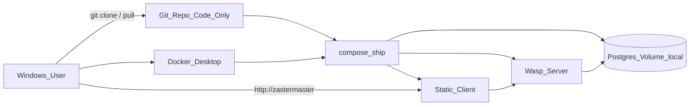

# Shipping plan — Zaster Master

How to **distribute the app to other people** without putting bank data online.  
Status: **requirements locked**; implementation not done yet (see checklist below).

Related: [`../README.md`](../README.md) · [`.cursor/rules/8-environment-deployment.mdc`](../../.cursor/rules/8-environment-deployment.mdc) · [`design.md`](design.md)

---

## Goals

| Goal | Decision |
|---|---|
| Who runs it | Each person installs and runs **locally** on their own PC |
| What may be online | **Code only** (public Git repo is OK) |
| What must stay local | Bank exports, Postgres data, user settings / balances |
| Audience | **Windows**, little / no development experience |
| Allowed installs | **Docker Desktop** (required) + **Git** (clone / update) |
| Updates | `git pull` + start/update script |
| Auth / cloud hosting | **Out of scope** (no shared server, no login) |

---

## Non-goals

- Cloud deploy (Fly, Railway, …)
- Multi-user / auth
- Native `.exe` without Docker
- End-user **feature manual** (how Analyse / Kategorien work) — that stays in `ai/docs/*` for developers
- Publishing `Bankauszüge/`, DB dumps, or real `.env` files

---

## Public repo & privacy

Making the GitHub/GitLab repo **public is fine** if:

- `Bankauszüge/` stays gitignored (already)
- Real `.env` / `.env.server` stay gitignored (already)
- No personal CSVs, screenshots with balances, or DB dumps in history
- Only examples like `.env.server.example` (localhost dummy credentials) are committed

**Runtime privacy:** Ship bind addresses are **`127.0.0.1` only** — not reachable from the internet or other LAN devices by default. Data lives in a **local Docker volume**.

Before going public: scan the repo + git history once for accidental secrets / real bank files.

---

## Target UX (end user)

1. Install **Docker Desktop** and start it  
2. Install **Git** (if missing)  
3. `git clone` the public repo  
4. Run **`start.bat`** (or equivalent) → `docker compose up --build -d`  
5. Open **`http://zastermaster`** in the browser (no port in the URL)  
6. Update later: **`update.bat`** → `git pull` + rebuild/restart  
7. Stop: **`stop.bat`**

**Docs to write for them:** setup / install / update / backup / troubleshooting only — **not** how to use the finance features.

---

## Friendly URL: `http://zastermaster`

Users should not type `localhost:3000`.

| Piece | Approach |
|---|---|
| Hostname | Windows **hosts** entry: `127.0.0.1 zastermaster` (once; needs Admin) |
| Port | Map UI to **port 80** on `127.0.0.1` so the URL has no `:port` |
| Fallback | If 80 is taken: `http://zastermaster:3000` or `http://127.0.0.1:3000` (document in setup guide) |

Still localhost-only; this is not exposing the app on the internet.

---

## Architecture (ship)

**Contrast with current v1 dev setup:** today [`docker-compose.yml`](../../docker-compose.yml) runs **Postgres only**; the app runs via `wasp start` in WSL.  
**Ship** adds full **db + server + client** Compose. Builds happen **inside Docker** so recipients do **not** need WSL, Node, or the Wasp CLI.

Dev workflow for maintainers stays unchanged (WSL + `wasp start` + `docker compose up -d db`).

---

## Deliverables (to implement)

### 1. Compose + images

- Ship Compose file (e.g. `docker-compose.ship.yml` or Compose profile `ship`)
- Services: `db`, `server`, `client`
- Internal `DATABASE_URL` to `db`
- `WASP_WEB_CLIENT_URL` / `WASP_SERVER_URL` aligned with `http://zastermaster`
- Publish ports only as `127.0.0.1:80:…` (and fallback mapping if needed)
- Named volume for Postgres (survives updates)
- Multi-stage Dockerfiles: Wasp build in builder → server image; Vite static → nginx (or similar) for client
- Run migrations on server start (Wasp default)

### 2. Windows scripts (repo root)

- `start.bat` — ensure Docker running, compose up --build, open browser optional  
- `stop.bat`  
- `update.bat` — `git pull` + compose up --build  
- Optional `backup.bat` — `pg_dump` to a folder on disk  
- Optional helper to add the `zastermaster` hosts entry (UAC/Admin once)

### 3. Env

- `.env.ship.example` → copied to gitignored `.env.ship` on first start  
- No real secrets in git

### 4. Documentation

| Doc | Audience | Content |
|---|---|---|
| **This file** [`shipping-plan.md`](shipping-plan.md) | Maintainer / agents | Requirements + architecture + checklist |
| Setup guide e.g. `ANLEITUNG.md` (root or `docs/`) | End users | Docker, Git, clone, start, update, URL, backup, troubleshooting — **setup only** |
| Update [`../README.md`](../README.md) + env Cursor rule | Devs | Point to ship path; keep “dev = Postgres-only Compose” |

**Not** an end-user product handbook.

### 5. Asset layout

Static design assets live only under **`public/design/`** (logos, nav SVGs, background rasters). There is no separate `Design/` folder.
---

## Honest constraints

- First `compose up --build` (and updates that change dependencies) can take **several minutes**
- Git is a second install beside Docker (needed for update path)
- Port 80 can conflict with other Windows software → document fallback
- Hosts edit needs one elevated run

---

## Implementation checklist

- [ ] Ship Compose + Dockerfiles (server + client)
- [ ] Localhost-only publish + `zastermaster` hosts helper
- [ ] `start` / `stop` / `update` (+ optional `backup`) `.bat`
- [ ] `.env.ship.example` + first-run copy
- [ ] End-user **setup** guide (`ANLEITUNG.md`)
- [ ] Link from README + environment Cursor rule
- [ ] Smoke test: fresh clone path with **only** Docker Desktop + Git (no Wasp on host)
- [ ] Pre-public repo scan (no `Bankauszüge`, no real env)

---

## Decision log

| Date | Decision |
|---|---|
| 2026-07-27 | Local install per person; code may be public; data never online |
| 2026-07-27 | Docker Desktop OK as only heavy prerequisite; Git for clone/update |
| 2026-07-27 | Updates via `git pull` + scripts |
| 2026-07-27 | Friendly URL `http://zastermaster` (port 80 + hosts); bind `127.0.0.1` |
| 2026-07-27 | Setup Anleitung yes; app usage Anleitung no |
| 2026-07-27 | Public repo OK given gitignore + localhost runtime |
