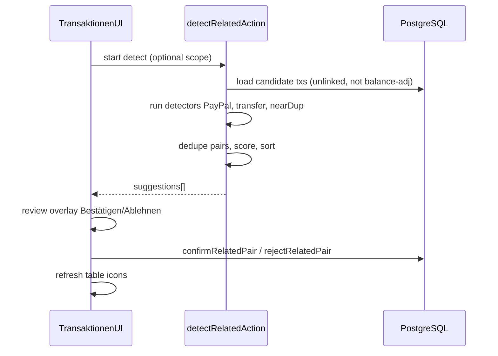

# Transaktionen — Zaster Master

Browse, filter, categorize, and link imported bank rows. Overview also in [`../README.md`](../README.md); visuals in [`design.md`](design.md); Analyse period logic in [`analysis.md`](analysis.md).

## Purpose

1. See **all** (or filtered) transactions in a wide table.
2. Fix categories with clear **Konfidenz** feedback.
3. Optionally **teach** the hybrid categorizer (“remember this”).
4. Find and confirm **zusammengehörige** transactions (PayPal↔bank, own-account transfers, near-duplicates).
5. Jump from a row to its **linked** partner.

**Not** the job of this page: charts/period analytics (Analyse), editing the category tree (Einstellungen), or importing files (Upload — though success lands here).

## Page layout

```
┌─ Summary strip ──────────────────────────────────────────┐
│ Einnahmen · Ausgaben · # Buchungen   (for current filters)│
├─ Toolbar ────────────────────────────────────────────────┤
│ Filter & Optionen · Zusammengehörige erkennen · page size │
├─ Data table (many columns) ──────────────────────────────┤
│ … paginated rows …                                       │
└──────────────────────────────────────────────────────────┘
```

Default route after logo / app home. One frosted content panel; **wide multi-column table** (not a two-column page). Horizontal scroll on smaller widths is OK.

## Summary strip (page-level)

| Metric | Definition |
|---|---|
| **Einnahmen** | Sum of positive `betrag` in the **current filtered set** (not only the current page) |
| **Ausgaben** | Sum of abs(negative `betrag`) in that set |
| **Buchungen** | Count of rows in that set |

**Defaults:** no date filter → **all imported transactions** (unlike Analyse, which defaults to the current calendar year).

Header **Balance** (wealth) stays in the global header and is **not** repeated here.

Optional later: Netto on this strip; v1 can omit it to keep the strip light.

## Filters & Optionen

Compact toolbar (desktop: one row; mobile: sheet/drawer).

### Filters (affect table + summary)

| Filter | Behavior |
|---|---|
| **Bank / Konto** | Multi-select; empty = all |
| **Zeitraum** | Optional from–to (or presets). Empty = all time |
| **Typ** | Alle / Ausgaben / Einnahmen |
| **Kategorie / Unterkategorie** | Optional |
| **Konfidenz / Quelle** | Optional: manual / learned / keyword / none / low — for cleaning up bad auto-cats |
| **Suche** | Optional free text over Verwendungszweck, Sender, Empfänger |
| **Nur unverknüpfte** | Optional checkbox — help related-detect cleanup |
| **Saldo-Buchungen ausblenden** | Hide `isBalanceAdjustment` opening/calibration rows (default **on**) |

Changing filters refetches the list query and recomputes the summary for the filtered set (server-side).

### Column visibility (Optionen)

| Column | Default |
|---|---|
| Bank | visible |
| Konto | visible |
| Datum | visible |
| Sender | visible |
| Empfänger | visible |
| Verwendungszweck | visible |
| Betrag | visible |
| Kategorie | visible (show main; subcategory in cell or tooltip) |
| Konfidenz | visible |
| Details | visible (action) |
| IBAN | **hidden** — toggle in Optionen |
| Kundenreferenz | **hidden** — toggle |
| Verknüpfte Transaktion | **hidden** — toggle (icon/link when linked) |

Persist column visibility in `localStorage` (per browser) in v1.

## Table

### Sorting

- Default: `datum` **descending**, then `id` descending.
- Clickable headers for Datum, Betrag, Bank, Konto, Kategorie (optional v1: at least Datum + Betrag).

### Pagination

| Setting | Value |
|---|---|
| Default page size | **100** |
| Choices | 50 / 100 / 250 / 500 |
| UI | Prev / next + “Seite x von y” (or equivalent) |

Server-side pagination only — never load all rows into the client for normal browsing.

### Cell rendering

| Column | Rules |
|---|---|
| **Betrag** | `de-DE` EUR; signed; **green** if `> 0`, **red** if `< 0` |
| **Kategorie** | Main name; subcategory secondary (muted) or `Haupt › Unter` |
| **Konfidenz** | Color + short label (see below). Not color-only (a11y) |
| **Verknüpfte Transaktion** | Clickable link/icon → `getTransactionNav` → jump list page if needed → **scroll to row** (brief highlight) → open **Details** of partner. If current filters hide the partner, open Details only. |
| **Details** | Button opens Details overlay |
| Long text | Truncate Verwendungszweck with tooltip/title for full text |

### Inline categorize (optional v1)

- Prefer **Details overlay** as the full categorize UX.
- Nice-to-have: inline category/subcategory selects on the row for power users; must still support “remember” (checkbox in inline popover or only in Details).

## Konfidenz

Full rules: [`categorization.md`](categorization.md). Color follows **source**:

| Source | Color | Label (DE examples) |
|---|---|---|
| Manual edit | Green | Manuell |
| Learned rule | Blue | Gelernt |
| Keyword match | Yellow/amber | Stichwort |
| None / fallback Sonstige | Gray | Keine |

Manual categorize sets score `1.0` and source `manual`.

## Details overlay

Opens on **Details**. Desktop: two sides inside the dialog — **left** all fields, **right** categorize. Mobile: stacked.

### Left — fields (read-only unless we add edits later)

Id, Bank, Konto, Datum, Betrag, Sender, Empfänger, Verwendungszweck, IBAN, Kundenreferenz, export balance (if any), related link, confidence/source, category/subcategory.

Balance-adjustment rows: badge “Saldo / Eröffnung” so they’re recognizable.

### Right — categorize

1. Select **Kategorie** (from DB tree managed in Einstellungen).
2. Select **Unterkategorie** (filtered by category).
3. Checkbox: **Diese Zuordnung merken** → create/update `LearnedRule` (fragment rules in [`categorization.md`](categorization.md); Slice 3 Thick).
4. Speichern → updates row **and linked partner** (same category/subcategory/source); closes or stays open with success state; table row refreshes.

Categories/subcategories are **not** created here — only chosen. Tree editing = Einstellungen.

## Zusammengehörige Transaktionen erkennen

Plan for **frontend** and **server logic**. Long-running **action** + UI progress in v1 (no job queue). Analyse **netting** after confirm is specified in [`analysis.md`](analysis.md); this section is only about **finding and confirming** pairs.

### Goals

| Goal | Meaning |
|---|---|
| Find PayPal ↔ bank | Same purchase appears on wallet and on Giro |
| Find Umbuchungen | Money moved between own Konten (Giro ↔ Tagesgeld, etc.) |
| Find near-duplicates | Suspicious same-day same-amount twins (review only) |
| Never auto-link | User always confirms or rejects |
| Idempotent re-runs | Skip already linked pairs; skip persisted rejects |

### High-level flow



---

### Frontend plan

#### Entry points

1. Toolbar button: **Zusammengehörige Transaktionen erkennen** (primary).
2. Optional later: from Details “Partner suchen” for one row (scoped detect) — not required for v1.

While detect runs: disable the button (or show spinner on it); rest of the table stays usable. Do **not** lock the whole app nav unless the overlay is open and modal.

#### Overlay states

| State | UI |
|---|---|
| `idle` | Closed |
| `running` | Modal open; Progress (determinate if server reports stages, else indeterminate). German stage labels when available |
| `review` | List of suggestion cards; counter “1 / N” |
| `empty` | “Keine neuen Vorschläge” + Schließen |
| `error` | Message + Erneut versuchen / Schließen |

#### Progress stages (map 1:1 to server stages)

1. Daten laden  
2. PayPal ↔ Bank prüfen  
3. Umbuchungen prüfen  
4. Ähnliche Buchungen prüfen  
5. Vorschläge aufbereiten  

#### Review card (one suggestion)

Desktop: **two columns** (tx A | tx B). Mobile: A stacked above B.

Show for each leg:

- Id, Bank, Konto, Datum, Betrag (`de-DE`, signed colors), Verwendungszweck (full, wrap)

Between columns / above:

- Type badge: `PayPal↔Bank` | `Umbuchung` | `Ähnlich`
- Optional confidence/score as “Trefferqualität” (high/medium/low from server score)
- Short reason string from server (e.g. “Gleicher Betrag, 1 Tag Abstand”)

Actions per card:

- **Bestätigen** → `confirmRelatedPair({ aId, bId, type })` → remove card from list, update local state; **sync category** onto both legs (prefer stronger `categorySource`, else the first leg that has category/sub)
- **Ablehnen** → `rejectRelatedPair({ aId, bId })` → remove card

Batch (optional v1):

- **Alle bestätigen** / **Alle ablehnen** for remaining list (with confirm dialog for “alle bestätigen”)

Footer: Schließen (keeps already confirmed links; unfinished suggestions are simply not confirmed — next detect can show them again unless rejected).

#### After confirm (UI)

- Invalidate `getTransactions` (and summary if needed).
- Show link icon in **Verknüpfte Transaktion** column when that column is visible; always show a small link affordance in Details.
- Click partner: `getTransactionNav` → jump list page if needed → **scroll to row** (highlight) → open **Details** of partner. If filters hide the partner, open Details only.
- Overlays (Details, Zusammengehörige erkennen, Balance): centered over the **frosted content panel (page)**, not the full browser viewport/display.

#### Unlink (v1 nice-to-have)

In Details of a linked row: **Verknüpfung lösen** → clear both directions. Re-detect may suggest the pair again unless we also write a reject — prefer clear link only; user can reject on next detect if needed.

---

### Server logic plan

Module: `src/features/related/detect.ts` (pure functions) + `operations.ts` (Wasp action wrappers).

#### Inputs

```ts
// conceptual
detectRelatedTransactions({
  // v1: all accounts; optional later:
  // accountIds?: number[]
  // dateFrom?: Date
  // dateTo?: Date
})
```

#### Load set

From DB, load transactions where:

- `relatedTransactionId` is null  
- `isBalanceAdjustment` is false  
- optional date/account scope  

Fields needed: `id, datum, betrag, bank, konto, sender, empfaenger, verwendungszweck, relatedTransactionId`.

Also load:

- Existing **confirmed** links (to skip)  
- Persisted **rejects** as unordered pair keys `minId:maxId`

#### Pair key

Always store undirected key: `pairKey(a,b) = `${min(a,b)}:${max(a,b)}``.

A transaction may appear in **at most one accepted suggestion per detect run** (greedy: highest score first). Already linked txs never enter candidates.

#### Constants (v1)

| Name | Value |
|---|---|
| `DATE_TOLERANCE_DAYS` | 3 |
| `AMOUNT_TOLERANCE` | 0.01 (€ |
| `NEAR_DUP_WORD_OVERLAP` | 0.5 |
| `TRANSFER_KEYWORDS` | `überweisung`, `umbuchung`, `transfer`, `eigene konten`, … (casefold, umlaut-normalized) |

Normalize text: lowercase, collapse whitespace, optional ä→ae for keyword checks (keep display text unchanged).

#### Indexing (performance)

Avoid O(n²) over everything blindly:

1. Bucket by **rounded abs(betrag)** (e.g. cents as integer key).  
2. Within each amount bucket, sort by `datum`.  
3. For each tx, only compare neighbors within ±3 days in that bucket (and for transfers, also check opposite-sign bucket with same abs amount).

#### Detector A — PayPal ↔ bank

**Eligible legs:**

- Wallet: `bank === 'paypal'` (later: other wallets)  
- Bank: `bank` in `dkb | sparkasse | traderepublic` (or any non-paypal)

**Match when:**

- `sign(a.betrag) === sign(b.betrag)`  
- `abs(abs(a.betrag) - abs(b.betrag)) ≤ 0.01`  
- `abs(daysBetween(a.datum, b.datum)) ≤ 3`  
- One leg paypal, one leg not  
- Prefer also weak text hints if present (`paypal` in bank purpose) — bonus score, not required  

**Score (example):**  
`1.0 - 0.1 * dayDiff - 5 * amountDiff` → clamp 0..1; type `paypal_bank`.

**Reason:** e.g. `Gleicher Betrag (−42,00 €), 1 Tag Abstand`.

#### Detector B — Internal transfer (Umbuchung)

**Match when:**

- `a.bank/konto !== b.bank/konto` (different account identity)  
- Amounts ≈ **opposite**: `abs(a.betrag + b.betrag) ≤ 0.01` (same abs, opposite sign)  
- `abs(daysBetween) ≤ 3`  
- And **at least one** of:  
  - purpose/sender/empfaenger contains a transfer keyword, or  
  - name cross-match: token from account owner / “Sonja” / IBAN tail / konto name appears on the other leg (configurable later; v1: keyword **or** shared non-trivial token length ≥ 4 between purposes/names)

**Score:** base 0.85; +0.1 if keyword; −0.1 per extra day. Type `transfer`.

**Reason:** e.g. `Gegenbetrag, DKB Giro ↔ DKB Tagesgeld`.

#### Detector C — Near-duplicate

**Match when:**

- Same `bank` and same `konto`  
- Same calendar **day** (stricter than ±3)  
- `abs(amount diff) ≤ 0.01`  
- Same sign  
- Purpose word overlap ≥ 50%:  
  `overlap = |words(A) ∩ words(B)| / |words(A) ∪ words(B)|`  
  (ignore stopwords: `the`, `und`, `zahlung`, … keep it small)

**Score:** overlap value. Type `near_duplicate`.

**Reason:** e.g. `Gleiches Konto/Tag/Betrag, 70% Textähnlichkeit`.

Do **not** auto-delete; suggestion only.

#### Merge & rank suggestions

1. Collect all candidate pairs from A/B/C.  
2. Drop if `pairKey` in rejects or either id already linked.  
3. Drop duplicates of same `pairKey` (keep highest score; prefer type priority: `transfer` > `paypal_bank` > `near_duplicate` if scores close).  
4. Greedy: sort by score desc; assign pair if both ids still free; mark both ids used.  
5. Return list `{ pairKey, type, score, reason, a: PublicTx, b: PublicTx }[]`.

Cap list length (e.g. **100** per run) with note `truncated: true` if more existed — user re-runs after confirming.

#### Persist confirm / reject

**Confirm:**

```
A.relatedTransactionId = B.id
B.relatedTransactionId = A.id
store type on both or on a RelatedLink row (prefer RelatedLink table later; v1 fields on Transaction are enough: relatedTransactionId + optional relatedType)
```

If A or B already linked to someone else → `HttpError(409)`.

**Reject:**

Upsert `RelatedRejection { txIdLow, txIdHigh }` unique on pair key.

**Unlink:**

Set both `relatedTransactionId` to null; do not auto-create rejection.

#### Operations contract

| Op | Behavior |
|---|---|
| `detectRelatedTransactions` | Runs pipeline; returns `{ suggestions, stages?, truncated }` — may take seconds; UI shows progress. If too slow later → Jobs. |
| `confirmRelatedPair` | Bidirectional link; invalidate caches |
| `rejectRelatedPair` | Persist rejection |
| `unlinkRelatedPair` | Optional v1 |

Progress reporting v1 options (pick one):

- **Simple:** single action returns only at end; UI indeterminate progress (good enough if &lt; ~15s).  
- **Better:** action writes `DetectJob` row + client polls `getDetectJob` for stage/percent — only if simple feels too frozen.

**v1 lock:** start with **simple** (one action, indeterminate/step labels faked on client by time/stage enum if server returns quickly enough). If detect regularly &gt; 15s on real data, upgrade to poll/job without changing the review UI.

#### Client-side stage labels without polling

While awaiting the action, cycle stage text every few seconds (cosmetic). When response arrives, switch to `review` or `empty`. Honest enough for v1.

---

### Edge cases

| Case | Handling |
|---|---|
| Three-way matches (A↔B, A↔C) | Greedy highest score; only one partner per tx per run |
| Already linked | Excluded from load set |
| User confirms wrong pair | Unlink in Details; optionally reject afterward |
| Refunds (positive PayPal + positive bank) | Same-sign detector still applies |
| Transfer fees (amounts not exact opposite) | May miss — user can leave unlinked; later tolerance or manual link |
| Manual link | Optional later “manuell verknüpfen” in Details — out of scope v1 unless cheap |
| Empty DB | `empty` state immediately |

### Test plan (logic)

Unit-test pure detectors with fixtures:

1. PayPal −25 + DKB −25, 1 day apart → one `paypal_bank` suggestion  
2. Giro −100 + Tagesgeld +100, “Umbuchung” → `transfer`  
3. Same account two −10 same day similar purpose → `near_duplicate`  
4. Rejected pair → not suggested again  
5. Already linked → not suggested  
6. Balance-adjustment rows → never candidates  

### After linking (product reminder)

- Table still shows **both** rows.  
- Analyse nets per [`analysis.md`](analysis.md) (transfers drop both; PayPal↔bank keeps PayPal leg when both in filter).

## Balance-adjustment rows

Synthetic opening / calibration transactions:

- Flag `isBalanceAdjustment` (or equivalent).
- Hidden by default via filter “Saldo-Buchungen ausblenden”.
- Excluded from Analyse aggregates always.
- Visible here when the filter is off, with a clear badge.

## Dangerous actions

| Action | UX |
|---|---|
| **Delete all transactions** | Not on this page’s primary toolbar; if exposed (Einstellungen or hidden confirm), require typed confirm. Prefer rare. |
| Delete single row | Optional later; not required for v1 |

## Data / operations

| Operation | Kind | Purpose |
|---|---|---|
| `getTransactions` | query | Paginated list + filter args; returns rows for page |
| `getTransactionsSummary` | query | Einnahmen / Ausgaben / count for **same filters** (all matching rows, not one page) |
| `categorizeTransaction` | action | Set category/subcategory/source/score on row **and related partner**; optional `remember: true` → LearnedRule |
| `detectRelatedTransactions` | action | Run detectors; return suggestion list (may be chunked later) |
| `confirmRelatedPair` / `rejectRelatedPair` | actions | Persist link (and **sync category** to both legs) or rejection |
| `getTransactionNav` | query | Resolve partner row + list page under current filters (related-link navigation) |

List + summary share one filter input type. Categorize invalidates list/summary queries.

## UX locks (v1 product decisions)

Captured from product feedback; keep these when changing UI:

1. **Partner navigation** — Verknüpfung column is a real link: scroll + highlight + Details (not a dead icon).
2. **Overlay placement** — Details / Zusammengehörige erkennen / Balance open centered on the **content page** (frosted panel), not the middle of the full display.
3. **Shared category on related pairs** — editing category on one leg updates the other; confirming a pair aligns categories.

---

## Empty & loading

| State | UI |
|---|---|
| No imports yet | Empty state + CTA **Zum Upload** |
| Filters match nothing | “Keine Treffer” + reset filters |
| Loading | Table skeleton / spinner; don’t flash wrong page |
| Detect running | Progress in overlay; rest of app can stay usable or soft-lock the button only |

## Mobile

- Table: horizontal scroll or priority columns (Datum, Empfänger/Zweck, Betrag, Details).
- Filters in a bottom sheet.
- Details stacked; related review stacked (tx A above tx B).

## Out of scope (v1) / later

- Bulk categorize selected rows
- Inline edit of Verwendungszweck / amount
- Auto-merge duplicates (delete one row)
- Click from Analyse breakdown → pre-filtered Transaktionen (nice follow-up)

## Export

**CSV export** from the toolbar respects the current filters (semicolon, UTF-8 BOM for Excel). Cap: 100 000 rows.
